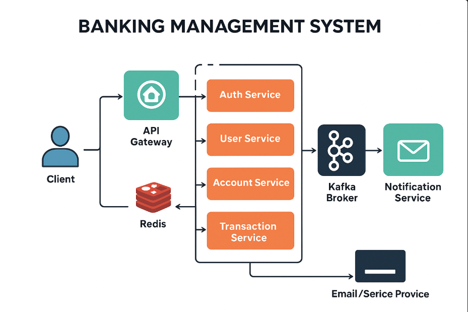

# 💳 Banking Management System — Scalable Microservices Architecture

A production-ready **Banking Management System** built using **Spring Boot Microservices**, **Kafka**, **Docker**, **JWT (RS256)**, with robust **Monitoring via Prometheus & Grafana**, **Service Discovery**, and **CI/CD via GitHub Actions**.

---

## 🚀 Core Features

| Microservice              | Role                                                            |
| ------------------------- | --------------------------------------------------------------- |
| 🔐 `auth-service`         | Handles RS256 JWT Authentication, Redis-backed token revocation |
| 👤 `user-service`         | Manages users, profiles, and role-based permissions             |
| 💼 `account-service`      | Creates/manages accounts with balance tracking                  |
| 💰 `transaction-service`  | Handles transfers, deposits, withdrawals (via Kafka events)     |
| 📢 `notification-service` | Sends SMS/email alerts on events (via Kafka listeners)          |


---

## ⚙️ Technology Stack

* Java 21 + Spring Boot 3.2.x
* Spring Cloud (Eureka, OpenFeign, Config)
* Kafka + Spring Kafka
* Spring Security + RS256 JWT
* Redis (for caching and token blacklist)
* MySQL (primary DB)
* Docker & Docker Compose
* Prometheus + Grafana for observability
* GitHub Actions for CI/CD pipelines

---

## 🧭 Microservices Architecture


*Illustrates API Gateway, service communication, Kafka event flow, and notification pipeline.*

```
[Client] → [API Gateway] → [Auth/User/Account/Transaction/... Services]
                          ↘
                         [Kafka Broker] → [Notification Service]
                                         ↘
                                       [Email/SMS Providers]
```

---

## 🔍 Monitoring (Prometheus + Grafana)

Each service exposes metrics via `/actuator/prometheus`.

### ✅ Metrics Tracked:

* JVM memory, GC, threads
* API response time, throughput
* Eureka instance health
* Kafka consumer lag
* DB & cache health

### 🔧 Prometheus `prometheus.yml` Sample:

```yaml
scrape_configs:
  - job_name: 'microservices'
    metrics_path: '/actuator/prometheus'
    static_configs:
      - targets:
          - 'auth-service:8081'
          - 'user-service:8082'
          - 'account-service:8083'
          - 'transaction-service:8084'
          - 'notification-service:8085'
          - 'loan-service:8086'
```

> 📈 Grafana dashboards provided for Kafka, JVM, API, Redis, MySQL.
docs/first.png
(docs/se.png)
(docs/th.png)
---

## 🔐 Authentication — JWT (RS256)

* Public/Private Key Pair for signing/validation
* Token includes roles, expiration, and issuer
* Redis stores blacklisted tokens for logout/invalidation
* Role-based access at API Gateway & service level

---

## 📬 Kafka Messaging

| Topic Name              | Producer Service      | Consumer Service       | Description                     |
| ----------------------- | --------------------- | ---------------------- | ------------------------------- |
| `user.registered`       | `user-service`        | `notification-service` | Notify on user registration     |
| `transaction.completed` | `transaction-service` | `notification-service` | Notify on completed transaction |
| `credit/debit`          | `account-service`     | `notification-service` | Notify on credit or debit       |

> Kafka makes the system **asynchronous, scalable, and decoupled**.

---

## 🔁 Eureka Discovery (Port `8761`)

All microservices register with Eureka at:

```
http://localhost:8761
```

> Load-balanced client-side discovery enabled via Spring Cloud LoadBalancer.

---

## 🐳 Dockerized Setup

```bash
docker-compose up --build
```

This spins up:

* ✔️ All 6 microservices
* ✔️ MySQL, Redis, Kafka + Zookeeper
* ✔️ Eureka Server (port 8761)
* ✔️ Prometheus (port 9090)
* ✔️ Grafana (port 3000)
* ✔️ API Gateway (optional addition)

---

## 🔐 Security Features

* RS256-signed JWT Auth
* Redis-backed token invalidation
* Role-based access control
* Centralized CORS & rate-limiting
* Secured internal endpoints with service tokens

---

## 📊 API Docs (Swagger)

Each service auto-generates OpenAPI docs:

```
http://localhost:<PORT>/swagger-ui.html
```

---

## ✉️ Notification Support

| Channel | Provider Options      |
| ------- | --------------------- |
| SMS     | Fast2SMS / Twilio     |
| Email   | SendGrid / Gmail SMTP |

> Services consume Kafka topics for notifications.

---

## 📦 CI/CD — GitHub Actions

`.github/workflows/ci.yml`:

```yaml
name: Build & Test Microservices

on: [push, pull_request]

jobs:
  build:
    runs-on: ubuntu-latest
    steps:
      - uses: actions/checkout@v3
      - name: Set up JDK
        uses: actions/setup-java@v3
        with:
          java-version: '21'
      - name: Build with Maven
        run: mvn clean install
```

✅ Auto testing for every PR or push.

---

## ⚖️ Scalability & Resilience

* Kafka decouples producers/consumers
* Eureka + Spring Cloud LoadBalancer = failover ready
* Redis for fast token operations
* Docker Compose for local orchestration
* Can be extended with Kubernetes for autoscaling

---

## 📁 Project Layout

```
banking-system/
├── auth-service/
├── user-service/
├── account-service/
├── transaction-service/
├── loan-service/
├── notification-service/
├── docker-compose.yml
├── prometheus.yml
├── docs/
│   └── architecture-diagram.png
└── .github/
    └── workflows/
        └── ci.yml
```

---

## 🧑‍💻 Author

**Akash Adak**
*Backend Architect | Microservices Specialist*
GitHub: [@Akash-Adak](https://github.com/Akash-Adak)

---

## 📜 License

MIT — Open to use, improve, and extend freely.

---

