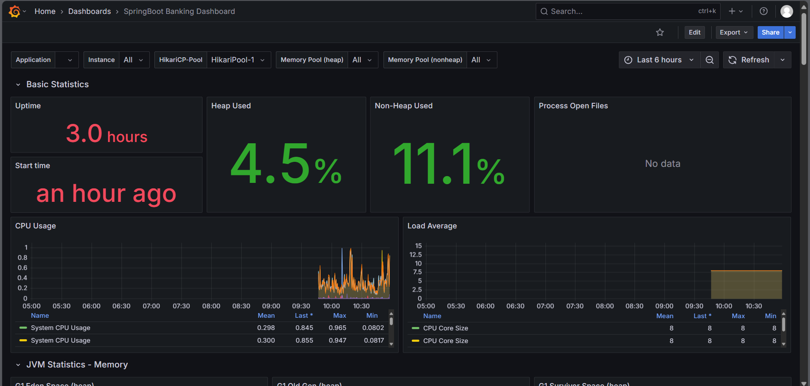
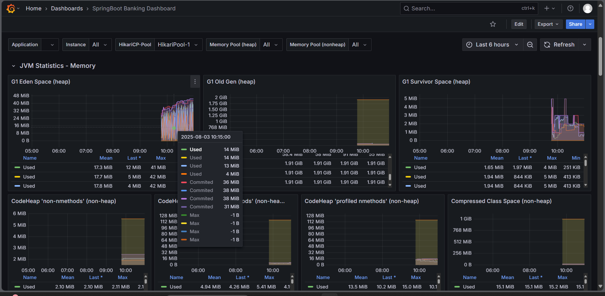
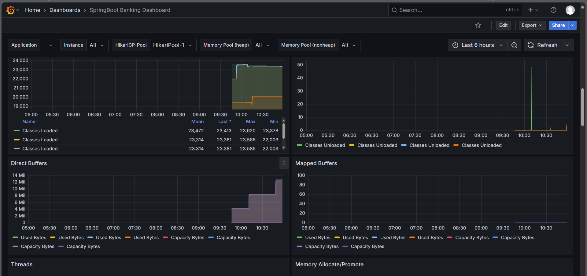

# 💳 Banking Management System — Scalable Microservices Architecture

A **production-ready Banking Management System** built with **Spring Boot Microservices**, **Kafka**, **Docker**, **JWT (RS256)**, **Prometheus + Grafana** monitoring, and **CI/CD via GitHub Actions**.  
Designed for **scalability, resilience, and decoupled microservice communication**.

---

## 🚀 Core Features

| Microservice              | Role                                                            |
| ------------------------- | --------------------------------------------------------------- |
| 🔐 `auth-service`         | Handles RS256 JWT Authentication, Redis-backed token revocation |
| 👤 `user-service`         | Manages users, profiles, and role-based permissions             |
| 💼 `account-service`      | Creates/manages accounts with balance tracking                  |
| 💰 `transaction-service`  | Handles transfers, deposits, withdrawals via Kafka events       |
| 📢 `notification-service` | Sends email/SMS alerts on events via Kafka                      |
| 🏦 `loan-service`         | Manages loan requests, approvals, and notifications             |

---

## ⚙️ Technology Stack

* **Backend:** Java 21, Spring Boot 3.2.x, Spring Cloud (Eureka, OpenFeign, Config)
* **Messaging:** Kafka + Spring Kafka
* **Security:** Spring Security + RS256 JWT, Redis token blacklist
* **Database & Cache:** MySQL, Redis
* **Orchestration:** Docker & Docker Compose
* **Monitoring:** Prometheus + Grafana
* **CI/CD:** GitHub Actions

---

## 🏗️ Microservices Architecture

```

[Client] → [API Gateway] → [Auth/User/Account/Transaction/Loan/... Services]
↘
[Kafka Broker] → [Notification Service]
↘
[Email/SMS Providers]

````

> All microservices register to Eureka for **service discovery** and **client-side load balancing**.


---

## 🐳 Docker Setup

All services are fully **dockerized** for local development and production-ready deployment.

```bash
# Build and run all services
docker-compose up --build -d
````

Services included in Docker Compose:

* MySQL (`3306`)
* Redis (`6379`)
* Kafka + Zookeeper (`9092` / `2181`)
* Eureka Server (`8761`)
* Auth/User/Account/Transaction/Notification/Loan Services (`8081-8086`)
* Prometheus (`9090`) & Grafana (`3000`)

### Optimized Docker Strategy

* Each microservice uses a **multi-stage build**:

    * Stage 1: Build JAR using JDK
    * Stage 2: Run JAR in **lightweight JRE Alpine** for small images (~120 MB)
* Pre-built JARs can also be used for faster builds.

---

## 🔐 Authentication (JWT RS256)

* Tokens signed with **private key**, verified by **public key**
* Redis stores **blacklisted tokens** for logout/invalidation
* Role-based access control at **API Gateway** and service endpoints

---

## 📬 Kafka Messaging

| Topic Name              | Producer Service      | Consumer Service       | Description                     |
| ----------------------- | --------------------- | ---------------------- | ------------------------------- |
| `user.registered`       | `user-service`        | `notification-service` | Notify on user registration     |
| `transaction.completed` | `transaction-service` | `notification-service` | Notify on completed transaction |
| `credit/debit`          | `account-service`     | `notification-service` | Notify on account changes       |

---

## 🔍 Monitoring

* Each service exposes Prometheus metrics via `/actuator/prometheus`
* Monitored metrics:

    * JVM memory, GC, threads
    * API response time & throughput
    * Eureka instance health
    * Kafka consumer lag
    * DB & cache health

### Prometheus Example Config

```yaml
scrape_configs:
  - job_name: 'microservices'
    metrics_path: '/actuator/prometheus'
    static_configs:
      - targets:
          - 'auth-service:8081'
          - 'user-service:8082'
          - 'account-service:8083'
          - 'transaction-service:8084'
          - 'notification-service:8085'
          - 'loan-service:8086'
```

> Grafana dashboards are pre-configured for **Kafka, JVM, API, Redis, and MySQL metrics**.
> 



---

## 📦 Project Layout

```
banking-system/
├── auth-service/
├── user-service/
├── account-service/
├── transaction-service/
├── loan-service/
├── notification-service/
├── docker-compose.yml
├── prometheus.yml
├── docs/
│   └── architecture-diagram.png
└── .github/
    └── workflows/
        └── ci.yml
```

---

## 🏗️ Fork & Contribution Workflow

1. **Fork** the repo on GitHub
2. **Clone** locally:

   ```bash
   git clone https://github.com/YOUR_USERNAME/Banking-system.git
   ```
3. **Create a branch** for your feature/bugfix:

   ```bash
   git checkout -b feature/awesome-feature
   ```
4. **Commit & push** changes:

   ```bash
   git add .
   git commit -m "Add awesome feature"
   git push origin feature/awesome-feature
   ```
5. **Open a Pull Request** against the original repo

> 🟢 All contributions should follow **branching, clean commits, and CI/CD checks**.

---

## 🧑‍💻 Author

**Akash Adak** — Backend Architect | Microservices Specialist
GitHub: [@Akash-Adak](https://github.com/Akash-Adak)

---
   


