# 🏦 Banking Management System

<div align="center">


**A production-ready microservices architecture for modern banking operations**

[Features](#-features) • [Quick Start](#-quick-start) • [Architecture](#-architecture) • [Monitoring](#-monitoring) • [Contributing](#-contributing)

</div>

---

## 🌟 Features

<table>
<tr>
<td width="50%">

### 🔐 **Security First**
- RS256 JWT Authentication
- Redis-backed token revocation
- Role-based access control (RBAC)
- API Gateway security layer

### 💼 **Core Banking Operations**
- Multi-account management
- Real-time transactions
- Loan processing & approvals
- Balance tracking & auditing

</td>
<td width="50%">

### ⚡ **Event-Driven Architecture**
- Kafka-based messaging
- Async notification system
- Email & SMS alerts
- Transaction event streaming

### 📊 **Production Ready**
- Prometheus metrics
- Grafana dashboards
- Health checks & monitoring
- CI/CD with GitHub Actions

</td>
</tr>
</table>

---

## 🏗️ Architecture

```mermaid
graph TB
    Client[🖥️ Client Applications]
    Gateway[🚪 API Gateway<br/>Port: 8080]
    Eureka[📡 Eureka Server<br/>Port: 8761]
    
    Auth[🔐 Auth Service<br/>Port: 8081]
    User[👤 User Service<br/>Port: 8082]
    Account[💼 Account Service<br/>Port: 8083]
    Transaction[💰 Transaction Service<br/>Port: 8084]
    Notification[📢 Notification Service<br/>Port: 8085]
    Loan[🏦 Loan Service<br/>Port: 8086]
    
    Kafka[📨 Kafka Broker<br/>Port: 9092]
    MySQL[(🗄️ MySQL<br/>Port: 3306)]
    Redis[(⚡ Redis<br/>Port: 6379)]
    
    Prometheus[📊 Prometheus<br/>Port: 9090]
    Grafana[📈 Grafana<br/>Port: 3000]
    
    Client --> Gateway
    Gateway --> Auth
    Gateway --> User
    Gateway --> Account
    Gateway --> Transaction
    Gateway --> Loan
    
    Auth -.->|Register| Eureka
    User -.->|Register| Eureka
    Account -.->|Register| Eureka
    Transaction -.->|Register| Eureka
    Notification -.->|Register| Eureka
    Loan -.->|Register| Eureka
    
    Transaction -->|Events| Kafka
    Account -->|Events| Kafka
    User -->|Events| Kafka
    Kafka -->|Consume| Notification
    
    Auth --> Redis
    User --> MySQL
    Account --> MySQL
    Transaction --> MySQL
    Loan --> MySQL
    
    Auth -->|Metrics| Prometheus
    User -->|Metrics| Prometheus
    Account -->|Metrics| Prometheus
    Transaction -->|Metrics| Prometheus
    Notification -->|Metrics| Prometheus
    Loan -->|Metrics| Prometheus
    
    Prometheus --> Grafana
    
    style Gateway fill:#4CAF50,stroke:#2E7D32,color:#fff
    style Kafka fill:#231F20,stroke:#000,color:#fff
    style Eureka fill:#2196F3,stroke:#1565C0,color:#fff
    style Prometheus fill:#E6522C,stroke:#C41E00,color:#fff
    style Grafana fill:#F46800,stroke:#D94600,color:#fff
    style MySQL fill:#4479A1,stroke:#00546B,color:#fff
    style Redis fill:#DC382D,stroke:#A41E11,color:#fff
```



---

## 🚀 Quick Start

### Prerequisites

```bash
# Required installations
- Docker 20.x+
- Docker Compose 2.x+
- Git
```

### 🐳 One-Command Setup

```bash
# Clone the repository
git clone https://github.com/Akash-Adak/Banking-system.git
cd Banking-system

# Start all services
docker-compose up -d

# Check service health
docker-compose ps

# View logs
docker-compose logs -f
```

### 🎯 Access Points

| Service | URL | Credentials |
|---------|-----|-------------|
| 🚪 API Gateway | `http://localhost:8080` | - |
| 📡 Eureka Dashboard | `http://localhost:8761` | - |
| 📊 Prometheus | `http://localhost:9090` | - |
| 📈 Grafana | `http://localhost:3000` | admin / admin |
| 🗄️ MySQL | `localhost:3306` | root / rootpassword |
| ⚡ Redis | `localhost:6379` | - |
| 📨 Kafka | `localhost:9092` | - |

---

## 🐳 Docker Compose Configuration

<details>
<summary><b>📄 Click to view complete docker-compose.yml</b></summary>

```yaml
version: '3.8'

services:
  # ==================== Infrastructure ====================
  
  mysql:
    image: mysql:8.0
    container_name: banking-mysql
    environment:
      MYSQL_ROOT_PASSWORD: rootpassword
      MYSQL_DATABASE: banking_db
    ports:
      - "3306:3306"
    volumes:
      - mysql-data:/var/lib/mysql
    networks:
      - banking-network
    healthcheck:
      test: ["CMD", "mysqladmin", "ping", "-h", "localhost"]
      interval: 10s
      timeout: 5s
      retries: 5

  redis:
    image: redis:7-alpine
    container_name: banking-redis
    ports:
      - "6379:6379"
    volumes:
      - redis-data:/data
    networks:
      - banking-network
    healthcheck:
      test: ["CMD", "redis-cli", "ping"]
      interval: 10s
      timeout: 5s
      retries: 5

  zookeeper:
    image: confluentinc/cp-zookeeper:7.5.0
    container_name: banking-zookeeper
    environment:
      ZOOKEEPER_CLIENT_PORT: 2181
      ZOOKEEPER_TICK_TIME: 2000
    ports:
      - "2181:2181"
    networks:
      - banking-network

  kafka:
    image: confluentinc/cp-kafka:7.5.0
    container_name: banking-kafka
    depends_on:
      - zookeeper
    ports:
      - "9092:9092"
    environment:
      KAFKA_BROKER_ID: 1
      KAFKA_ZOOKEEPER_CONNECT: zookeeper:2181
      KAFKA_ADVERTISED_LISTENERS: PLAINTEXT://kafka:29092,PLAINTEXT_HOST://localhost:9092
      KAFKA_LISTENER_SECURITY_PROTOCOL_MAP: PLAINTEXT:PLAINTEXT,PLAINTEXT_HOST:PLAINTEXT
      KAFKA_INTER_BROKER_LISTENER_NAME: PLAINTEXT
      KAFKA_OFFSETS_TOPIC_REPLICATION_FACTOR: 1
    networks:
      - banking-network
    healthcheck:
      test: ["CMD", "kafka-broker-api-versions", "--bootstrap-server", "localhost:9092"]
      interval: 30s
      timeout: 10s
      retries: 5

  # ==================== Service Discovery ====================
  
  eureka-server:
    build:
      context: ./eureka-server
      dockerfile: Dockerfile
    container_name: banking-eureka
    ports:
      - "8761:8761"
    networks:
      - banking-network
    environment:
      SPRING_PROFILES_ACTIVE: docker
    healthcheck:
      test: ["CMD", "curl", "-f", "http://localhost:8761/actuator/health"]
      interval: 30s
      timeout: 10s
      retries: 5

  # ==================== Microservices ====================
  
  auth-service:
    build:
      context: ./auth-service
      dockerfile: Dockerfile
    container_name: banking-auth
    ports:
      - "8081:8081"
    depends_on:
      mysql:
        condition: service_healthy
      redis:
        condition: service_healthy
      eureka-server:
        condition: service_healthy
    environment:
      SPRING_PROFILES_ACTIVE: docker
      SPRING_DATASOURCE_URL: jdbc:mysql://mysql:3306/banking_db
      SPRING_DATASOURCE_USERNAME: root
      SPRING_DATASOURCE_PASSWORD: rootpassword
      SPRING_REDIS_HOST: redis
      SPRING_REDIS_PORT: 6379
      EUREKA_CLIENT_SERVICEURL_DEFAULTZONE: http://eureka-server:8761/eureka/
    networks:
      - banking-network
    restart: on-failure

  user-service:
    build:
      context: ./user-service
      dockerfile: Dockerfile
    container_name: banking-user
    ports:
      - "8082:8082"
    depends_on:
      mysql:
        condition: service_healthy
      kafka:
        condition: service_healthy
      eureka-server:
        condition: service_healthy
    environment:
      SPRING_PROFILES_ACTIVE: docker
      SPRING_DATASOURCE_URL: jdbc:mysql://mysql:3306/banking_db
      SPRING_DATASOURCE_USERNAME: root
      SPRING_DATASOURCE_PASSWORD: rootpassword
      SPRING_KAFKA_BOOTSTRAP_SERVERS: kafka:29092
      EUREKA_CLIENT_SERVICEURL_DEFAULTZONE: http://eureka-server:8761/eureka/
    networks:
      - banking-network
    restart: on-failure

  account-service:
    build:
      context: ./account-service
      dockerfile: Dockerfile
    container_name: banking-account
    ports:
      - "8083:8083"
    depends_on:
      mysql:
        condition: service_healthy
      kafka:
        condition: service_healthy
      eureka-server:
        condition: service_healthy
    environment:
      SPRING_PROFILES_ACTIVE: docker
      SPRING_DATASOURCE_URL: jdbc:mysql://mysql:3306/banking_db
      SPRING_DATASOURCE_USERNAME: root
      SPRING_DATASOURCE_PASSWORD: rootpassword
      SPRING_KAFKA_BOOTSTRAP_SERVERS: kafka:29092
      EUREKA_CLIENT_SERVICEURL_DEFAULTZONE: http://eureka-server:8761/eureka/
    networks:
      - banking-network
    restart: on-failure

  transaction-service:
    build:
      context: ./transaction-service
      dockerfile: Dockerfile
    container_name: banking-transaction
    ports:
      - "8084:8084"
    depends_on:
      mysql:
        condition: service_healthy
      kafka:
        condition: service_healthy
      eureka-server:
        condition: service_healthy
    environment:
      SPRING_PROFILES_ACTIVE: docker
      SPRING_DATASOURCE_URL: jdbc:mysql://mysql:3306/banking_db
      SPRING_DATASOURCE_USERNAME: root
      SPRING_DATASOURCE_PASSWORD: rootpassword
      SPRING_KAFKA_BOOTSTRAP_SERVERS: kafka:29092
      EUREKA_CLIENT_SERVICEURL_DEFAULTZONE: http://eureka-server:8761/eureka/
    networks:
      - banking-network
    restart: on-failure

  notification-service:
    build:
      context: ./notification-service
      dockerfile: Dockerfile
    container_name: banking-notification
    ports:
      - "8085:8085"
    depends_on:
      kafka:
        condition: service_healthy
      eureka-server:
        condition: service_healthy
    environment:
      SPRING_PROFILES_ACTIVE: docker
      SPRING_KAFKA_BOOTSTRAP_SERVERS: kafka:29092
      EUREKA_CLIENT_SERVICEURL_DEFAULTZONE: http://eureka-server:8761/eureka/
    networks:
      - banking-network
    restart: on-failure

  loan-service:
    build:
      context: ./loan-service
      dockerfile: Dockerfile
    container_name: banking-loan
    ports:
      - "8086:8086"
    depends_on:
      mysql:
        condition: service_healthy
      kafka:
        condition: service_healthy
      eureka-server:
        condition: service_healthy
    environment:
      SPRING_PROFILES_ACTIVE: docker
      SPRING_DATASOURCE_URL: jdbc:mysql://mysql:3306/banking_db
      SPRING_DATASOURCE_USERNAME: root
      SPRING_DATASOURCE_PASSWORD: rootpassword
      SPRING_KAFKA_BOOTSTRAP_SERVERS: kafka:29092
      EUREKA_CLIENT_SERVICEURL_DEFAULTZONE: http://eureka-server:8761/eureka/
    networks:
      - banking-network
    restart: on-failure

  # ==================== Monitoring ====================
  
  prometheus:
    image: prom/prometheus:latest
    container_name: banking-prometheus
    ports:
      - "9090:9090"
    volumes:
      - ./prometheus.yml:/etc/prometheus/prometheus.yml
      - prometheus-data:/prometheus
    command:
      - '--config.file=/etc/prometheus/prometheus.yml'
      - '--storage.tsdb.path=/prometheus'
    networks:
      - banking-network
    depends_on:
      - auth-service
      - user-service
      - account-service
      - transaction-service
      - notification-service
      - loan-service

  grafana:
    image: grafana/grafana:latest
    container_name: banking-grafana
    ports:
      - "3000:3000"
    environment:
      GF_SECURITY_ADMIN_USER: admin
      GF_SECURITY_ADMIN_PASSWORD: admin
      GF_INSTALL_PLUGINS: grafana-piechart-panel
    volumes:
      - grafana-data:/var/lib/grafana
      - ./grafana/dashboards:/etc/grafana/provisioning/dashboards
      - ./grafana/datasources:/etc/grafana/provisioning/datasources
    networks:
      - banking-network
    depends_on:
      - prometheus

networks:
  banking-network:
    driver: bridge

volumes:
  mysql-data:
  redis-data:
  prometheus-data:
  grafana-data:
```

</details>

### 📦 Multi-Stage Dockerfile (All Services)

```dockerfile
# Build stage
FROM eclipse-temurin:21-jdk-alpine AS build
WORKDIR /app
COPY pom.xml .
COPY src ./src
RUN apk add --no-cache maven
RUN mvn clean package -DskipTests

# Runtime stage
FROM eclipse-temurin:21-jre-alpine
WORKDIR /app
COPY --from=build /app/target/*.jar app.jar
EXPOSE 8080
ENTRYPOINT ["java", "-jar", "app.jar"]
```

---

## 📊 Monitoring

### Prometheus Configuration

```yaml
global:
  scrape_interval: 15s
  evaluation_interval: 15s

scrape_configs:
  - job_name: 'spring-actuator'
    metrics_path: '/actuator/prometheus'
    static_configs:
      - targets:
          - 'auth-service:8081'
          - 'user-service:8082'
          - 'account-service:8083'
          - 'transaction-service:8084'
          - 'notification-service:8085'
          - 'loan-service:8086'
    relabel_configs:
      - source_labels: [__address__]
        target_label: instance
        regex: '([^:]+).*'
        replacement: '${1}'

  - job_name: 'kafka'
    static_configs:
      - targets: ['kafka:9092']

  - job_name: 'mysql'
    static_configs:
      - targets: ['mysql:3306']

  - job_name: 'redis'
    static_configs:
      - targets: ['redis:6379']
```

### 📈 Key Metrics Tracked

- **JVM Metrics**: Heap memory, GC pauses, thread count
- **HTTP Metrics**: Request rate, latency percentiles, error rates
- **Database**: Connection pool size, query duration
- **Kafka**: Consumer lag, message throughput
- **Business Metrics**: Transaction volume, user registrations, loan approvals

---

## 🔧 Useful Commands

```bash
# Start all services
docker-compose up -d

# Start specific service
docker-compose up -d auth-service

# View logs
docker-compose logs -f [service-name]

# Stop all services
docker-compose down

# Stop and remove volumes
docker-compose down -v

# Rebuild specific service
docker-compose up -d --build auth-service

# Scale a service
docker-compose up -d --scale transaction-service=3

# Check service health
docker-compose ps
docker inspect banking-mysql | grep -i health
```

---

## 📡 Kafka Topics

| Topic | Producer | Consumer | Description |
|-------|----------|----------|-------------|
| `user.registered` | user-service | notification-service | New user registration events |
| `transaction.completed` | transaction-service | notification-service | Transaction completion events |
| `account.credit` | account-service | notification-service | Credit/deposit notifications |
| `account.debit` | account-service | notification-service | Debit/withdrawal notifications |
| `loan.approved` | loan-service | notification-service | Loan approval notifications |
| `loan.rejected` | loan-service | notification-service | Loan rejection notifications |

---

## 🔐 Security Features

- **JWT RS256**: Asymmetric encryption with public/private key pairs
- **Token Revocation**: Redis-based blacklist for logout
- **Role-Based Access**: ADMIN, USER, MANAGER roles
- **API Gateway Security**: Centralized authentication
- **Rate Limiting**: Prevents API abuse
- **CORS Configuration**: Controlled cross-origin requests

---

## 🤝 Contributing

Contributions are welcome! Please follow these steps:

1. **Fork** the repository
2. **Create** a feature branch (`git checkout -b feature/amazing-feature`)
3. **Commit** your changes (`git commit -m 'Add amazing feature'`)
4. **Push** to branch (`git push origin feature/amazing-feature`)
5. **Open** a Pull Request

### Development Guidelines

- Follow Java coding conventions
- Write unit tests for new features
- Update documentation for API changes
- Ensure Docker builds pass
- Keep commits atomic and meaningful

---

## 📝 License

This project is licensed under the MIT License - see the [LICENSE](LICENSE) file for details.

---

## 👨‍💻 Author

**Akash Adak**  
🔗 GitHub: [@Akash-Adak](https://github.com/Akash-Adak)  
📧 Backend Architect | Microservices Specialist

---

## ⭐ Show Your Support

If you find this project helpful, please give it a ⭐ on GitHub!

---

<div align="center">

**Built with ❤️ using Spring Boot Microservices**


</div>