<div align="center">

# 🏦 Enterprise Banking Management System

[](https://spring.io/projects/spring-boot)
[](https://www.oracle.com/java/)
[](https://kafka.apache.org/)
[](https://www.docker.com/)
[](https://www.mysql.com/)
[](https://redis.io/)

**A production-ready microservices architecture for modern banking operations**

[Features](#-features) • [Quick Start](#-quick-start) • [Architecture](#-architecture) • [API Documentation](#-api-documentation) • [Monitoring](#-monitoring)

---

</div>

## 📋 Table of Contents

- [Overview](#-overview)
- [Features](#-features)
- [Architecture](#-architecture)
- [Technology Stack](#-technology-stack)
- [Getting Started](#-getting-started)
- [Service Details](#-service-details)
- [API Documentation](#-api-documentation)
- [Security](#-security)
- [Monitoring & Observability](#-monitoring--observability)
- [Development](#-development)
- [Deployment](#-deployment)
- [Contributing](#-contributing)
- [License](#-license)

---

## 🎯 Overview

The **Enterprise Banking Management System** is a full-featured, production-grade microservices application built with Spring Boot. It demonstrates modern software architecture patterns including:

- **Microservices Architecture** with Spring Cloud
- **Event-Driven Design** using Apache Kafka
- **Distributed Tracing** with OpenTelemetry
- **Centralized Authentication** with JWT
- **Real-time Monitoring** via Prometheus & Grafana
- **Container Orchestration** with Docker Compose

### 🎬 Live Demo

🔗 **Frontend**: [https://etb-bank.vercel.app](https://etb-bank.vercel.app)

---

## ✨ Features

<table>
<tr>
<td width="50%">

### 🔐 Security & Authentication
- RS256 JWT token authentication
- Redis-backed token revocation
- Role-based access control (RBAC)
- API Gateway security layer
- Session management
- Password encryption with BCrypt

### 💼 Core Banking Operations
- Multi-account management
- Real-time fund transfers
- Transaction history & auditing
- Balance tracking & reconciliation
- Account statement generation
- Currency support

</td>
<td width="50%">

### ⚡ Event-Driven Architecture
- Kafka-based messaging system
- Asynchronous notification system
- Email & SMS alerts
- Transaction event streaming
- Event sourcing capabilities
- Dead letter queue handling

### 📊 Production Ready
- Prometheus metrics collection
- Grafana dashboards
- Health checks & monitoring
- CI/CD with GitHub Actions
- Load balancing
- Fault tolerance & circuit breakers

</td>
</tr>
</table>

### 🏦 Additional Features

- **Loan Management**: Apply, approve, and manage loans with EMI calculation
- **Notification System**: Real-time email/SMS notifications for all transactions
- **Service Discovery**: Eureka-based dynamic service registration
- **API Gateway**: Centralized routing and load balancing
- **Distributed Logging**: Centralized log aggregation
- **Database Per Service**: Independent data management

---

## 🏗️ Architecture

### System Architecture Diagram

```mermaid
graph TB
    Client[🖥️ Client Applications<br/>Web/Mobile]
    Gateway[🚪 API Gateway<br/>Port: 8080<br/>Spring Cloud Gateway]
    Eureka[📡 Eureka Server<br/>Port: 8761<br/>Service Discovery]
    
    Auth[🔐 Auth Service<br/>Port: 8081<br/>JWT Authentication]
    User[👤 User Service<br/>Port: 8082<br/>User Management]
    Account[💼 Account Service<br/>Port: 8083<br/>Account Operations]
    Transaction[💰 Transaction Service<br/>Port: 8084<br/>Fund Transfers]
    Notification[📢 Notification Service<br/>Port: 8085<br/>Email/SMS]
    Loan[🏦 Loan Service<br/>Port: 8086<br/>Loan Processing]
    
    Kafka[📨 Kafka Broker<br/>Port: 9092<br/>Message Queue]
    MySQL[(🗄️ MySQL Database<br/>Port: 3306<br/>Relational DB)]
    Redis[(⚡ Redis Cache<br/>Port: 6379<br/>Session Store)]
    
    Prometheus[📊 Prometheus<br/>Port: 9090<br/>Metrics Collection]
    Grafana[📈 Grafana<br/>Port: 3000<br/>Visualization]
    
    Client -->|HTTPS| Gateway
    Gateway -->|Route| Auth
    Gateway -->|Route| User
    Gateway -->|Route| Account
    Gateway -->|Route| Transaction
    Gateway -->|Route| Loan
    
    Auth -.->|Register| Eureka
    User -.->|Register| Eureka
    Account -.->|Register| Eureka
    Transaction -.->|Register| Eureka
    Notification -.->|Register| Eureka
    Loan -.->|Register| Eureka
    Gateway -.->|Discover| Eureka
    
    Transaction -->|Events| Kafka
    Account -->|Events| Kafka
    User -->|Events| Kafka
    Loan -->|Events| Kafka
    Kafka -->|Consume| Notification
    
    Auth -->|Sessions| Redis
    Auth -->|Token Blacklist| Redis
    
    User -->|Persist| MySQL
    Account -->|Persist| MySQL
    Transaction -->|Persist| MySQL
    Loan -->|Persist| MySQL
    
    Auth -->|Metrics| Prometheus
    User -->|Metrics| Prometheus
    Account -->|Metrics| Prometheus
    Transaction -->|Metrics| Prometheus
    Notification -->|Metrics| Prometheus
    Loan -->|Metrics| Prometheus
    
    Prometheus -->|Dashboard| Grafana
    
    style Gateway fill:#4CAF50,stroke:#2E7D32,color:#fff
    style Kafka fill:#231F20,stroke:#000,color:#fff
    style Eureka fill:#2196F3,stroke:#1565C0,color:#fff
    style Prometheus fill:#E6522C,stroke:#C41E00,color:#fff
    style Grafana fill:#F46800,stroke:#D94600,color:#fff
    style MySQL fill:#4479A1,stroke:#00546B,color:#fff
    style Redis fill:#DC382D,stroke:#A41E11,color:#fff
```



### Microservices Communication

| From Service | To Service | Protocol | Purpose |
|--------------|------------|----------|---------|
| API Gateway | All Services | HTTP/REST | Request routing |
| Transaction Service | Account Service | HTTP/REST | Balance validation |
| All Services | Eureka | HTTP | Service registration |
| Auth Service | Redis | TCP | Token management |
| All Services | MySQL | TCP | Data persistence |
| Transaction/Account/User | Kafka | TCP | Event publishing |
| Notification Service | Kafka | TCP | Event consumption |

---

## 🛠️ Technology Stack

### Backend
- **Framework**: Spring Boot 3.2.x
- **Language**: Java 21 (LTS)
- **Build Tool**: Maven 3.9.x
- **Spring Cloud**: 2023.0.x

### Microservices Components
- **Service Discovery**: Netflix Eureka
- **API Gateway**: Spring Cloud Gateway
- **Config Server**: Spring Cloud Config
- **Circuit Breaker**: Resilience4j

### Database & Cache
- **RDBMS**: MySQL 8.0
- **Cache**: Redis 7.x
- **ORM**: Spring Data JPA / Hibernate

### Messaging & Events
- **Message Broker**: Apache Kafka 3.x
- **Serialization**: Apache Avro / JSON

### Security
- **Authentication**: JWT (RS256)
- **Authorization**: Spring Security
- **Password Hashing**: BCrypt

### Monitoring & Observability
- **Metrics**: Micrometer + Prometheus
- **Visualization**: Grafana
- **Logging**: SLF4J + Logback
- **Tracing**: Spring Cloud Sleuth

### DevOps
- **Containerization**: Docker
- **Orchestration**: Docker Compose
- **CI/CD**: GitHub Actions
- **Version Control**: Git

---

## 🚀 Getting Started

### Prerequisites

Before you begin, ensure you have the following installed:

```bash
# Check installations
docker --version        # Docker 20.x or higher
docker-compose --version # Docker Compose 2.x or higher
git --version           # Git 2.x or higher
java --version          # Java 21 (optional, for local dev)
mvn --version          # Maven 3.9.x (optional, for local dev)
```

### Installation

#### 🐳 Option 1: Docker Compose (Recommended)

```bash
# 1. Clone the repository
git clone https://github.com/Akash-Adak/Banking-system.git
cd Banking-system

# 2. Configure environment variables (optional)
cp .env.example .env
nano .env  # Edit as needed

# 3. Start all services
docker-compose up -d

# 4. Verify services are running
docker-compose ps

# 5. View logs
docker-compose logs -f

# 6. Wait for services to be healthy (2-3 minutes)
# Check health: http://localhost:8761
```

#### 💻 Option 2: Local Development

```bash
# 1. Clone and setup
git clone https://github.com/Akash-Adak/Banking-system.git
cd Banking-system

# 2. Start infrastructure services
docker-compose up -d mysql redis kafka zookeeper

# 3. Build all services
mvn clean install -DskipTests

# 4. Start Eureka Server
cd eureka-server
mvn spring-boot:run &

# 5. Start other services (in separate terminals)
cd auth-service && mvn spring-boot:run &
cd user-service && mvn spring-boot:run &
cd account-service && mvn spring-boot:run &
cd transaction-service && mvn spring-boot:run &
cd notification-service && mvn spring-boot:run &
cd loan-service && mvn spring-boot:run &
```

### 🎯 Access Points

| Service | URL | Credentials | Description |
|---------|-----|-------------|-------------|
| 🚪 API Gateway | `http://localhost:8080` | - | Main entry point |
| 📡 Eureka Dashboard | `http://localhost:8761` | - | Service registry |
| 📊 Prometheus | `http://localhost:9090` | - | Metrics |
| 📈 Grafana | `http://localhost:3000` | admin / admin | Dashboards |
| 🗄️ MySQL | `localhost:3306` | root / rootpassword | Database |
| ⚡ Redis | `localhost:6379` | - | Cache |
| 📨 Kafka | `localhost:9092` | - | Message broker |

### Health Check

```bash
# Check all services health
curl http://localhost:8761/actuator/health

# Check specific service
curl http://localhost:8081/actuator/health  # Auth Service
curl http://localhost:8082/actuator/health  # User Service
curl http://localhost:8083/actuator/health  # Account Service
```

---

## 🔧 Service Details

### 1. 🔐 Auth Service (Port: 8081)

**Purpose**: Centralized authentication and authorization

**Key Features**:
- User registration and login
- JWT token generation (RS256)
- Token validation and refresh
- Redis-based token revocation
- Role-based access control

**Endpoints**:
```
POST   /api/auth/register     - Register new user
POST   /api/auth/login        - Login and get JWT token
POST   /api/auth/refresh      - Refresh access token
POST   /api/auth/logout       - Logout and revoke token
GET    /api/auth/validate     - Validate JWT token
```

### 2. 👤 User Service (Port: 8082)

**Purpose**: User profile and information management

**Key Features**:
- User profile CRUD operations
- User search and filtering
- Profile picture management
- KYC verification status
- User preferences

**Endpoints**:
```
GET    /api/users             - Get all users (admin)
GET    /api/users/{id}        - Get user by ID
PUT    /api/users/{id}        - Update user profile
DELETE /api/users/{id}        - Delete user (admin)
GET    /api/users/me          - Get current user profile
PUT    /api/users/me/password - Change password
```

### 3. 💼 Account Service (Port: 8083)

**Purpose**: Bank account management

**Key Features**:
- Create multiple account types (Savings, Current, Fixed Deposit)
- Account balance management
- Account statement generation
- Interest calculation
- Account freeze/unfreeze

**Endpoints**:
```
POST   /api/accounts                  - Create new account
GET    /api/accounts                  - Get all accounts for user
GET    /api/accounts/{accountNumber}  - Get account details
PUT    /api/accounts/{accountNumber}  - Update account info
DELETE /api/accounts/{accountNumber}  - Close account
GET    /api/accounts/{accountNumber}/balance - Get balance
GET    /api/accounts/{accountNumber}/statement - Get statement
```

### 4. 💰 Transaction Service (Port: 8084)

**Purpose**: Handle all financial transactions

**Key Features**:
- Fund transfers (within bank)
- Deposit and withdrawal
- Transaction history
- Transaction status tracking
- Rollback support
- Duplicate transaction prevention

**Endpoints**:
```
POST   /api/transactions/transfer     - Transfer funds
POST   /api/transactions/deposit      - Deposit money
POST   /api/transactions/withdraw     - Withdraw money
GET    /api/transactions              - Get transaction history
GET    /api/transactions/{id}         - Get transaction details
GET    /api/transactions/account/{accountNumber} - Get account transactions
```

### 5. 📢 Notification Service (Port: 8085)

**Purpose**: Send notifications to users

**Key Features**:
- Email notifications
- SMS notifications (Twilio integration)
- Kafka event consumption
- Notification templates
- Delivery status tracking
- Retry mechanism

**Kafka Topics Consumed**:
```
user.registered           - Welcome email
transaction.completed     - Transaction alert
account.credit           - Credit notification
account.debit            - Debit notification
loan.approved            - Loan approval
loan.rejected            - Loan rejection
```

### 6. 🏦 Loan Service (Port: 8086)

**Purpose**: Loan application and management

**Key Features**:
- Loan application submission
- Credit score verification
- Loan approval workflow
- EMI calculation
- Repayment tracking
- Loan closure

**Endpoints**:
```
POST   /api/loans/apply              - Apply for loan
GET    /api/loans                    - Get all loans
GET    /api/loans/{id}               - Get loan details
PUT    /api/loans/{id}/approve       - Approve loan (admin)
PUT    /api/loans/{id}/reject        - Reject loan (admin)
POST   /api/loans/{id}/repay         - Make EMI payment
GET    /api/loans/{id}/schedule      - Get EMI schedule
```

### 7. 📡 Eureka Server (Port: 8761)

**Purpose**: Service discovery and registration

**Features**:
- Dynamic service registration
- Health monitoring
- Load balancing support
- Failover handling

### 8. 🚪 API Gateway (Port: 8080)

**Purpose**: Single entry point for all services

**Features**:
- Request routing
- Load balancing
- Rate limiting
- Authentication filter
- CORS handling
- Request/response logging

---

## 📚 API Documentation

### Authentication Flow


### Sample API Requests

#### 1. Register User

```bash
curl -X POST http://localhost:8080/api/auth/register \
  -H "Content-Type: application/json" \
  -d '{
    "username": "john.doe",
    "email": "john@example.com",
    "password": "SecurePass123!",
    "firstName": "John",
    "lastName": "Doe",
    "phoneNumber": "+1234567890"
  }'
```

**Response**:
```json
{
  "id": "usr_123456",
  "username": "john.doe",
  "email": "john@example.com",
  "firstName": "John",
  "lastName": "Doe",
  "createdAt": "2024-12-23T10:30:00Z"
}
```

#### 2. Login

```bash
curl -X POST http://localhost:8080/api/auth/login \
  -H "Content-Type: application/json" \
  -d '{
    "username": "john.doe",
    "password": "SecurePass123!"
  }'
```

**Response**:
```json
{
  "accessToken": "eyJhbGciOiJSUzI1NiIs...",
  "refreshToken": "eyJhbGciOiJSUzI1NiIs...",
  "tokenType": "Bearer",
  "expiresIn": 3600
}
```

#### 3. Create Account

```bash
curl -X POST http://localhost:8080/api/accounts \
  -H "Authorization: Bearer YOUR_TOKEN" \
  -H "Content-Type: application/json" \
  -d '{
    "accountType": "SAVINGS",
    "currency": "USD",
    "initialDeposit": 1000.00
  }'
```

**Response**:
```json
{
  "accountNumber": "ACC1234567890",
  "accountType": "SAVINGS",
  "balance": 1000.00,
  "currency": "USD",
  "status": "ACTIVE",
  "createdAt": "2024-12-23T10:35:00Z"
}
```

#### 4. Transfer Funds

```bash
curl -X POST http://localhost:8080/api/transactions/transfer \
  -H "Authorization: Bearer YOUR_TOKEN" \
  -H "Content-Type: application/json" \
  -d '{
    "fromAccount": "ACC1234567890",
    "toAccount": "ACC0987654321",
    "amount": 500.00,
    "currency": "USD",
    "description": "Payment for services"
  }'
```

**Response**:
```json
{
  "transactionId": "TXN_789012",
  "fromAccount": "ACC1234567890",
  "toAccount": "ACC0987654321",
  "amount": 500.00,
  "status": "SUCCESS",
  "timestamp": "2024-12-23T10:40:00Z",
  "referenceNumber": "REF123456789"
}
```

### Error Responses

All services follow a standard error format:

```json
{
  "timestamp": "2024-12-23T10:45:00Z",
  "status": 400,
  "error": "Bad Request",
  "message": "Insufficient balance",
  "path": "/api/transactions/transfer",
  "traceId": "abc123def456"
}
```

**HTTP Status Codes**:
- `200 OK` - Successful request
- `201 Created` - Resource created
- `400 Bad Request` - Invalid request data
- `401 Unauthorized` - Missing or invalid token
- `403 Forbidden` - Insufficient permissions
- `404 Not Found` - Resource not found
- `409 Conflict` - Resource conflict (e.g., duplicate account)
- `500 Internal Server Error` - Server error
- `503 Service Unavailable` - Service down

---

## 🔒 Security

### JWT Authentication

The system uses **RS256 (RSA Signature with SHA-256)** for JWT token generation:

```
Header:
{
  "alg": "RS256",
  "typ": "JWT"
}

Payload:
{
  "sub": "user_id",
  "username": "john.doe",
  "roles": ["USER"],
  "iat": 1703331000,
  "exp": 1703334600
}
```

**Key Features**:
- Asymmetric encryption (public/private key pair)
- Token expiration (1 hour for access token, 7 days for refresh token)
- Redis-based token blacklist for logout
- Automatic token refresh mechanism

### Role-Based Access Control

| Role | Permissions |
|------|-------------|
| **USER** | - View own profile<br/>- Manage own accounts<br/>- Perform transactions<br/>- Apply for loans |
| **MANAGER** | - All USER permissions<br/>- Approve loans<br/>- View customer accounts<br/>- Generate reports |
| **ADMIN** | - All MANAGER permissions<br/>- Manage users<br/>- Configure system<br/>- Access all endpoints |

### Security Best Practices

1. **Password Security**
    - Minimum 8 characters
    - BCrypt hashing (cost factor: 12)
    - Password history tracking
    - Forced password change every 90 days

2. **API Security**
    - Rate limiting (100 requests per minute)
    - CORS configuration
    - SQL injection prevention
    - XSS protection

3. **Data Security**
    - Sensitive data encryption at rest
    - TLS/SSL for data in transit
    - PII (Personally Identifiable Information) masking in logs
    - Regular security audits

---

## 📊 Monitoring & Observability

### Prometheus Metrics

**Exposed Metrics**:
- JVM metrics (heap, threads, GC)
- HTTP request metrics (rate, duration, errors)
- Database connection pool metrics
- Kafka consumer lag
- Custom business metrics

**Prometheus Configuration** (`prometheus.yml`):

```yaml
global:
  scrape_interval: 15s
  evaluation_interval: 15s
  external_labels:
    cluster: 'banking-system'
    environment: 'production'

scrape_configs:
  - job_name: 'spring-actuator'
    metrics_path: '/actuator/prometheus'
    static_configs:
      - targets:
          - 'auth-service:8081'
          - 'user-service:8082'
          - 'account-service:8083'
          - 'transaction-service:8084'
          - 'notification-service:8085'
          - 'loan-service:8086'
    relabel_configs:
      - source_labels: [__address__]
        target_label: instance
        regex: '([^:]+).*'
        replacement: '${1}'

  - job_name: 'kafka-exporter'
    static_configs:
      - targets: ['kafka:9092']

  - job_name: 'redis-exporter'
    static_configs:
      - targets: ['redis:6379']
```

### Grafana Dashboards

**Pre-configured Dashboards**:

1. **System Overview**
    - Service health status
    - Request rate and latency
    - Error rate
    - Active users

2. **JVM Metrics**
    - Heap memory usage
    - GC pause time
    - Thread count
    - CPU usage

3. **Business Metrics**
    - Transaction volume
    - Transaction success rate
    - Account creation rate
    - Loan approval rate
    - Revenue tracking

4. **Kafka Metrics**
    - Message throughput
    - Consumer lag
    - Partition distribution
    - Broker status

### Accessing Dashboards

```bash
# 1. Open Grafana
http://localhost:3000

# 2. Login (default credentials)
Username: admin
Password: admin

# 3. Navigate to Dashboards → Banking System
```

### Sample Queries

```promql
# Total requests per service
sum(rate(http_server_requests_seconds_count[5m])) by (application)

# Error rate
sum(rate(http_server_requests_seconds_count{status=~"5.."}[5m])) 
  / 
sum(rate(http_server_requests_seconds_count[5m]))

# 95th percentile latency
histogram_quantile(0.95, 
  sum(rate(http_server_requests_seconds_bucket[5m])) by (le, application)
)

# JVM memory usage
jvm_memory_used_bytes{area="heap"} / jvm_memory_max_bytes{area="heap"}
```

---

## 💻 Development

### Project Structure

```
Banking-system/
├── .github/
│   └── workflows/
│       └── ci-cd.yml                    # GitHub Actions CI/CD
├── account-service/
│   ├── src/
│   │   ├── main/
│   │   │   ├── java/com/banking/account/
│   │   │   │   ├── controller/
│   │   │   │   ├── service/
│   │   │   │   ├── repository/
│   │   │   │   ├── model/
│   │   │   │   ├── dto/
│   │   │   │   ├── config/
│   │   │   │   └── AccountServiceApplication.java
│   │   │   └── resources/
│   │   │       ├── application.yml
│   │   │       └── application-docker.yml
│   │   └── test/
│   ├── Dockerfile
│   └── pom.xml
├── auth-service/
├── user-service/
├── transaction-service/
├── notification-service/
├── loan-service/
├── eureka-server/
├── api-gateway/
├── docs/
│   ├── api-docs.md
│   ├── architecture.md
│   └── deployment.md
├── docker-compose.yml
├── prometheus.yml
├── .env.example
├── .gitignore
├── README.md
├── LICENSE
└── pom.xml                              # Parent POM
```

### Building from Source

```bash
# Build all services
mvn clean package -DskipTests

# Build specific service
cd auth-service
mvn clean package

# Run tests
mvn test

# Run with specific profile
mvn spring-boot:run -Dspring-boot.run.profiles=dev
```

### Running Tests

```bash
# Unit tests
mvn test

# Integration tests
mvn verify

# Test coverage report
mvn jacoco:report

# View coverage report
open target/site/jacoco/index.html
```

### Code Quality

```bash
# Run static code analysis
mvn sonar:sonar

# Check for security vulnerabilities
mvn dependency-check:check

# Format code
mvn spotless:apply
```

### Database Migrations

Using **Flyway** for version control:

```bash
# Location: src/main/resources/db/migration/

V1__initial_schema.sql
V2__add_account_types.sql
V3__add_loan_tables.sql
```

Apply migrations:
```bash
mvn flyway:migrate
```

---

## 🚢 Deployment

### Docker Compose Production

```bash
# Build production images
docker-compose -f docker-compose.prod.yml build

# Start in detached mode
docker-compose -f docker-compose.prod.yml up -d

# Scale services
docker-compose -f docker-compose.prod.yml up -d --scale transaction-service=3

# Rolling update
docker-compose -f docker-compose.prod.yml up -d --no-deps --build transaction-service
```

### Kubernetes Deployment

```bash
# Deploy to Kubernetes
kubectl apply -f k8s/

# Check deployment status
kubectl get pods -n banking-system

# View logs
kubectl logs -f deployment/transaction-service -n banking-system

# Scale deployment
kubectl scale deployment transaction-service --replicas=5 -n banking-system
```

### Environment Variables

Create `.env` file in root directory:

```bash
# Database
MYSQL_ROOT_PASSWORD=your_secure_password
MYSQL_DATABASE=banking_db

# Redis
REDIS_PASSWORD=your_redis_password

# JWT
JWT_SECRET_KEY=your_jwt_secret_key
JWT_EXPIRATION=3600000

# Kafka
KAFKA_BOOTSTRAP_SERVERS=kafka:29092

# Email (SMTP)
SMTP_HOST=smtp.gmail.com
SMTP_PORT=587
SMTP_USERNAME=your_email@gmail.com
SMTP_PASSWORD=your_app_password

# SMS (Twilio)
TWILIO_ACCOUNT_SID=your_twilio_sid
TWILIO_AUTH_TOKEN=your_twilio_token
TWILIO_PHONE_NUMBER=+1234567890

# Monitoring
GRAFANA_ADMIN_PASSWORD=your_grafana_password
```

### CI/CD Pipeline

**GitHub Actions** workflow (`.github/workflows/ci-cd.yml`):

```yaml
name: CI/CD Pipeline

on:
  push:
    branches: [ main, develop ]
  pull_request:
    branches: [ main ]

jobs:
  test:
    runs-on: ubuntu-latest
    steps:
      - uses: actions/checkout@v3
      - name: Set up JDK 21
        uses: actions/setup-java@v3
        with:
          java-version: '21'
          distribution: 'temurin'
      - name: Run tests
        run: mvn clean verify

  build:
    needs: test
    runs-on: ubuntu-latest
    steps:
      - uses: actions/checkout@v3
      - name: Build Docker images
        run: docker-compose build
      - name: Push to Docker Hub
        run: |
          echo ${{ secrets.DOCKER_PASSWORD }} | docker login -u ${{ secrets.DOCKER_USERNAME }} --password-stdin
          docker-compose push

  deploy:
    needs: build
    runs-on: ubuntu-latest
    if: github.ref == 'refs/heads/main'
    steps:
      - name: Deploy to production
        run: |
          # Add your deployment script here
```

---

## 🤝 Contributing

We welcome contributions! Please follow these steps
